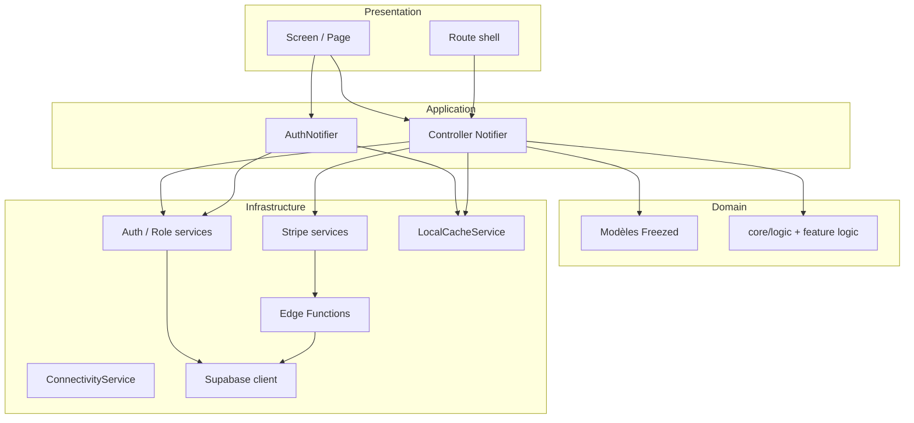

# Architecture MadBeauty

Structure Flutter, choix techniques et découpage en couches. Index de toute la doc : [README.md](./README.md).

## Vue d’ensemble

MadBeauty est une application **Flutter** (**iOS**, **Android**, **Web** / Netlify) orientée **client** et **prestataire** beauté afro. Backend : **Supabase** (PostgreSQL, Auth, Storage, Realtime, Edge Functions). Paiements : **Stripe Connect** (réservations) + **Stripe Billing** (abonnement prestataire), activés côté app selon [`StripePlatformPolicy`](../lib/core/config/stripe_platform_policy.dart) (aujourd’hui **Web** en priorité, stores sans IAP).

Objectifs prod : robustesse (erreurs réseau, états vides, concurrence), performance (cache images, providers `autoDispose`, timeouts), sécurité (RLS, pas de secrets dans Flutter), UX (retry, messages clairs).

## Stack

| Domaine | Choix |
|---------|--------|
| UI | Flutter / Dart 3.8+, Material, thème `AppArea` (vert client / bleu prestataire) |
| État | Riverpod 3 (`AsyncNotifier`, `Notifier`, `StreamProvider`) |
| Navigation | go_router — `redirect`, routes nommées (`AppNavigationX`), shells client / prestataire / admin |
| Modèles | Freezed + `json_serializable` dans `lib/core/models/domain/` |
| Backend | Supabase Auth, PostgREST, Storage, Realtime, Edge Functions (Deno/TS) |
| Paiements | `flutter_stripe` / `flutter_stripe_web` + Edge Functions Stripe |
| Push | Firebase Cloud Messaging + notifications locales |
| Offline | Connectivité + cache local (`SharedPreferences`) ; sync incrémentale |

## Choix techniques

### Riverpod

- État global et asynchrone prévisible ; tests via `ProviderContainer` + `overrides`.
- Auth : `authNotifierProvider` ; écrans : contrôleurs `Notifier` ; flux : `StreamProvider` / `FutureProvider`.
- Préférer `autoDispose` pour les providers liés à un écran (skill perf).

### go_router

- Navigation déclarative, deep links, garde d’accès centralisée.
- `goRouterProvider` lit l’auth ; `redirect` gère public / invité / authentifié / rôle.
- Assemblage mince dans `lib/router/app_router.dart` ; modules dans `lib/router/routes/` et shells dans `lib/router/shell/`.
- Auth feature : routes co-localisées sous `features/auth/*/routes/`.

### Thème & responsive

- `RouterThemeScope` adapte **AppArea** selon la route (sans `setState` pendant le build).
- Mobile + Web : breakpoints via `DiscoveryResponsive` ; shell web adaptatif (rail / barre du haut, pas de bottom nav style app). Voir skill `madbeauty-responsive`.

### Stripe

- Connect Express pour encaisser les prestations ; Checkout / Billing pour l’abonnement prestataire.
- Montants et règles produit : [product/PRICING.md](./product/PRICING.md).
- Setup & tests : [payments/](./payments/README.md).

## Structure des dossiers (`lib/`)

```
lib/
├── main.dart / app.dart      # Entrée, MaterialApp.router, thème
├── core/                     # Transversal, sans UI métier
│   ├── config/               # AppConfig, pricing, Stripe policy
│   ├── constants/            # Chaînes UI (CoreStrings, AuthStrings, …)
│   ├── errors/               # AppFailure, FailureMapper
│   ├── logic/                # Règles pures (booking, messaging, …)
│   ├── models/domain/        # Freezed + SupabaseDomainCodec
│   └── providers/            # Connectivité, cache keys, hooks transverses
├── features/                 # Domaines UI + logique feature
│   ├── auth/                 # login, register, reset, providers auth
│   ├── home/, listing/, booking/, messaging/, reviews/, …
│   ├── prestataire/, profile/, favorites/, referral/, …
│   ├── notifications/, offline/, admin/, …
│   └── splash/, help/, support/, …
├── router/                   # go_router, redirects, shells, deep links
├── services/                 # Accès données & intégrations
│   ├── supabase/, auth/, stripe/, notifications/
│   ├── network/, storage/, offline/, location/, …
└── shared/                   # Thème, layout responsive, widgets réutilisables
```

**Règle** : pas de logique métier lourde dans les seuls widgets ; orchestration dans notifiers / controllers.

### Dépendances interdites

| Depuis | Interdit |
|--------|----------|
| `services/` | `features/*/screens`, `features/*/widgets` |
| `services/` | `features/*/providers` (préférer façade / callback côté feature) |
| `core/` | tout `features/` |
| `shared/widgets/` | `features/` (sauf extensions nav déjà en place) |

Fichier **> ~400 lignes** → scinder (voir [engineering/REFACTOR_PLAN.md](./engineering/REFACTOR_PLAN.md)).

## Schéma des couches



| Couche | Rôle | Exemples |
|--------|------|----------|
| **Presentation** | Widgets, layout, pas de règles métier lourdes | `*_screen.dart`, widgets feature |
| **Application** | Orchestration, état d’écran | `*_controller.dart`, `auth_notifier.dart` |
| **Domain** | Modèles immuables, règles pures | `core/models/domain/`, `core/logic/` |
| **Infrastructure** | Supabase, Stripe, cache, FCM | `services/*`, Edge Functions |

## Données et sérialisation

- Modèles métier : **`lib/core/models/domain/`** (Freezed + JSON + `SupabaseDomainCodec`).
- Schéma SQL / RLS : [backend/DB_SCHEMA.md](./backend/DB_SCHEMA.md) — source de vérité migrations : `supabase/migrations/`.
- Après changement Freezed : `dart run build_runner build --delete-conflicting-outputs`.
- Fichiers générés `*.freezed.dart` / `*.g.dart` : **commités**.

## Intégrations clés

| Intégration | Doc |
|-------------|-----|
| Schéma & RLS | [backend/DB_SCHEMA.md](./backend/DB_SCHEMA.md) |
| Stripe Connect / abonnement | [payments/](./payments/README.md) |
| Push FCM | [notifications/PUSH.md](./notifications/PUSH.md) |
| Partage fiche prestataire | [product/PRESTATAIRE_SHARE.md](./product/PRESTATAIRE_SHARE.md) |
| iOS / App Store | [store/](./store/APP_STORE_CONNECT.md) |
| Auth prod (dashboard) | [supabase/AUTH_PRODUCTION_CHECKLIST.md](../supabase/AUTH_PRODUCTION_CHECKLIST.md) |

## Tests

- **Unitaires** : validateurs, view states, contrôleurs (overrides), providers critiques, codec domaine — `test/`.
- **CI / PR** : `flutter analyze`, `flutter test` ; migrations testées si SQL modifié.
- E2E device + staging : à étendre selon [product/FEATURES.md](./product/FEATURES.md).

## Références

- Produit / roadmap : [product/FEATURES.md](./product/FEATURES.md)
- Contribution : [CONTRIBUTING.md](./CONTRIBUTING.md)
- Refactor en cours : [engineering/REFACTOR_PLAN.md](./engineering/REFACTOR_PLAN.md)
- Skills Cursor : `.cursor/skills/madbeauty*` (responsive, UI, UX states, perf, Supabase)
