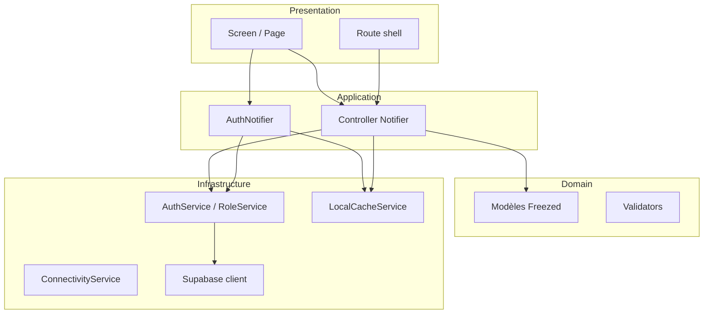

# Architecture MadBeauty

Documentation de la structure Flutter, des choix techniques et du découpage en couches.

## Vue d’ensemble

MadBeauty est une application **Flutter** (iOS / Android) orientée **client** et **prestataire** beauté. Le backend cible est **Supabase** (PostgreSQL, Auth, Storage, Realtime). L’app vise une évolution **offline-first** incrémentale : fondations (connectivité, cache local) en place, enrichissement par feature.

## Choix techniques

### Riverpod

- **Pourquoi** : état global et asynchrone prévisible, tests facilités (`ProviderContainer` + `overrides`), intégration naturelle avec les services async (auth, réseau).
- **Usage actuel** :
  - `AsyncNotifier` / providers pour l’**auth** (`authNotifierProvider`), le **profil accueil**, la **connectivité**.
  - `Notifier` pour les **contrôleurs** d’écran (login, register) et la logique de formulaire.
  - `StreamProvider` / `FutureProvider` pour les flux (ex. statut en ligne).

### go_router

- **Pourquoi** : navigation déclarative, **deep links**, garde d’accès centralisée (`redirect`), **routes nommées** pour un code stable.
- **Usage actuel** :
  - `GoRouter` fourni par `goRouterProvider` (lit l’état d’auth via Riverpod).
  - `redirect` : routes publiques vs invité vs **authentification obligatoire** ; chemin préféré selon rôle mis en cache (`LocalCacheService.selectedRole`).
  - Extensions `AppNavigationX` (`navigation_extensions.dart`) pour `goNamed` / `pushNamed` typés.

### Thème dynamique

- `RouterThemeScope` adapte **AppArea** (client = vert, prestataire = bleu) selon la route courante, en évitant les `setState` pendant le build.

## Structure des dossiers (`lib/`)

```
lib/
├── main.dart                 # Point d’entrée, init cache local
├── app.dart                  # MaterialApp.router + RouterThemeScope
├── core/                     # Transversal, sans UI métier lourde
│   ├── config/               # AppConfig, env
│   ├── constants/            # Chaînes (CoreStrings, AuthStrings, …), AppArea
│   ├── errors/               # AppFailure, FailureMapper
│   ├── models/               # user_role, domain (Freezed)
│   └── providers/            # connectivity, cache keys exposés
├── features/                 # Par domaine fonctionnel (UI + logique feature)
│   ├── auth/                 # login, register, role, providers auth
│   ├── splash/
│   ├── home/
│   ├── prestataire/
│   ├── booking/, search/, profile/, messaging/, reviews/, stats/
│   └── ...
├── router/                   # go_router, noms de routes, extensions nav
├── services/                 # Accès données & intégrations
│   ├── supabase/
│   ├── auth/
│   ├── network/
│   └── storage/
└── shared/                   # Thème, widgets réutilisables
    ├── theme/
    └── widgets/
```

## Schéma des couches

Flux typique **UI → logique → services → backend** :



| Couche | Rôle | Exemples |
|--------|------|----------|
| **Presentation** | Widgets, mise en page, aucune règle métier lourde | `login_page.dart`, `home_screen.dart` |
| **Application** | Orchestration, état d’écran, coordination providers | `login_controller.dart`, `auth_notifier.dart` |
| **Domain** | Modèles immuables, règles pures (validation) | `lib/core/models/domain/`, `login_validators.dart` |
| **Infrastructure** | Supabase, stockage, réseau | `auth_service.dart`, `local_cache_service.dart` |

## Données et sérialisation

- Modèles métier dans **`lib/core/models/domain/`** (Freezed + JSON + `SupabaseDomainCodec` pour lignes PostgREST).
- Les **features** consomment ces modèles via des repositories / services à enrichir au fil des écrans.

## Tests

- **Unitaires** : validateurs, view states, contrôleurs (overrides), providers critiques, codec domaine.
- Les tests **E2E UI** complets sont prévus pour une phase ultérieure (device + backend de staging).

## Références

- Schéma base : [DB_SCHEMA.md](./DB_SCHEMA.md)
- Feuille de route produit : [FEATURES.md](./FEATURES.md)
- Contribution : [CONTRIBUTING.md](./CONTRIBUTING.md)
