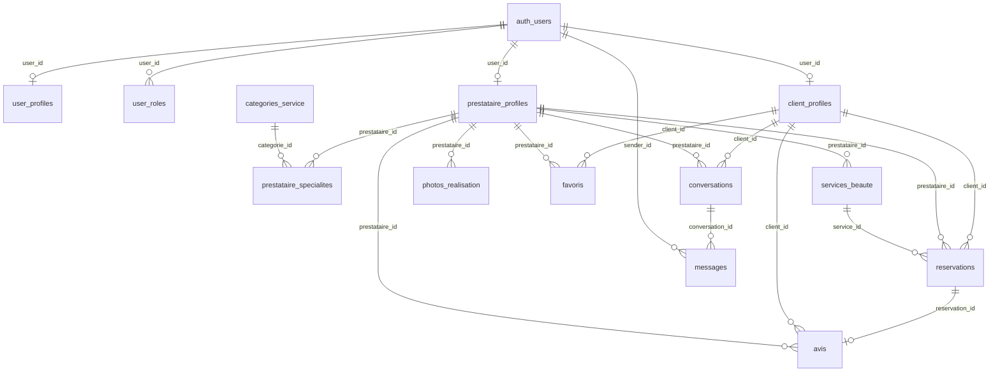

# Schéma base de données MadBeauty (Supabase / PostgreSQL)

Référence des tables **`public`**, colonnes, relations et **Row Level Security (RLS)** après application des migrations du dépôt.

> Ordre d’application : `20260507140000_init_extensions` → `20260507215055_init_schema` (vide) → `20260508113500_auth_profiles_and_roles` → `20260510120000_domain_schema_core` → `20260512200000_user_profiles_select_prestataire_catalog` → `20260512210000_user_roles_update_policy` → `20260512220000_categories_service_seed_types` → `20260512230000_profile_photos_storage` → `20260514110000_realisation_photos_storage` → `20260514122000_catalog_anon_and_role_profiles` → `20260515100000_booking_unique_active_slot` → `20260518120000_reservations_notes_prestataire_realtime` → `20260518140000_disponibilites_indisponibilites`.

---

## Types énumérés

| Type | Valeurs |
|------|---------|
| `public.app_role` | `client`, `prestataire` |

---

## Tables auth / profil global

### `auth.users` (schéma Supabase, non listé ici en détail)

Référence standard Supabase : `id`, `email`, métadonnées, etc.

### `public.user_profiles`

Profil identité (1:1 avec `auth.users`). Remplace l’ancienne table `profiles` après migration `20260510120000`.

| Colonne | Type | Contraintes |
|---------|------|-------------|
| `id` | `uuid` | PK, `default gen_random_uuid()` |
| `user_id` | `uuid` | NOT NULL, UNIQUE, FK → `auth.users(id)` ON DELETE CASCADE |
| `nom` | `text` | nullable |
| `prenom` | `text` | nullable |
| `avatar_url` | `text` | nullable |
| `telephone` | `text` | nullable |
| `updated_at` | `timestamptz` | NOT NULL, default `now()` ; trigger `set_updated_at` |

**Trigger** : `trg_user_profiles_updated_at` → `public.set_updated_at()`.

### `public.user_roles`

Rôles applicatifs (multi-rôle par utilisateur).

| Colonne | Type | Contraintes |
|---------|------|-------------|
| `user_id` | `uuid` | PK (composite), FK → `auth.users(id)` ON DELETE CASCADE |
| `role` | `app_role` | PK (composite) |
| `created_at` | `timestamptz` | NOT NULL, default `now()` |

**Trigger auth** : `handle_new_user` sur `auth.users` insère une ligne `user_profiles`, le rôle `client` dans `user_roles` et une ligne `client_profiles`.

**Trigger rôle** : `trg_user_roles_ensure_profile` sur `user_roles` crée automatiquement le profil métier associé au rôle ajouté (`client_profiles` pour `client`, `prestataire_profiles` pour `prestataire`).

---

## Profils métier client / prestataire

### `public.client_profiles`

| Colonne | Type | Contraintes |
|---------|------|-------------|
| `id` | `uuid` | PK |
| `user_id` | `uuid` | NOT NULL, UNIQUE, FK → `auth.users(id)` ON DELETE CASCADE |
| `adresse` | `text` | nullable |
| `created_at` | `timestamptz` | NOT NULL, default `now()` |

### `public.prestataire_profiles`

| Colonne | Type | Contraintes |
|---------|------|-------------|
| `id` | `uuid` | PK |
| `user_id` | `uuid` | NOT NULL, UNIQUE, FK → `auth.users(id)` ON DELETE CASCADE |
| `nom_salon` | `text` | nullable |
| `bio` | `text` | nullable |
| `ville` | `text` | nullable |
| `latitude` | `double precision` | nullable |
| `longitude` | `double precision` | nullable |
| `note_moyenne` | `double precision` | nullable |
| `is_verified` | `boolean` | NOT NULL, default `false` |
| `created_at` | `timestamptz` | NOT NULL, default `now()` |

**Index** : `idx_prestataire_profiles_ville` sur `ville`.

---

## Catalogue

### `public.categories_service`

| Colonne | Type | Contraintes |
|---------|------|-------------|
| `id` | `uuid` | PK |
| `nom` | `text` | NOT NULL |
| `icone` | `text` | nullable |

### `public.prestataire_specialites`

Table de liaison **prestataire ↔ catégorie**.

| Colonne | Type | Contraintes |
|---------|------|-------------|
| `prestataire_id` | `uuid` | PK (composite), FK → `prestataire_profiles(id)` ON DELETE CASCADE |
| `categorie_id` | `uuid` | PK (composite), FK → `categories_service(id)` ON DELETE CASCADE |

### `public.services_beaute`

| Colonne | Type | Contraintes |
|---------|------|-------------|
| `id` | `uuid` | PK |
| `prestataire_id` | `uuid` | NOT NULL, FK → `prestataire_profiles(id)` ON DELETE CASCADE |
| `nom` | `text` | NOT NULL |
| `duree_minutes` | `integer` | NOT NULL, `> 0` |
| `prix` | `numeric(12,2)` | NOT NULL, `>= 0` |
| `is_actif` | `boolean` | NOT NULL, default `true` |

**Index** : `idx_services_beaute_prestataire` sur `prestataire_id`.

---

## Disponibilités prestataire

### `public.disponibilites`

Plages horaires **récurrentes** (base des créneaux réservables côté app).

| Colonne | Type | Contraintes |
|---------|------|-------------|
| `id` | `uuid` | PK, `default gen_random_uuid()` |
| `prestataire_id` | `uuid` | NOT NULL, FK → `prestataire_profiles(id)` ON DELETE CASCADE |
| `jour_semaine` | `smallint` | NOT NULL, `0`–`6` (`0` = dimanche, convention PostgreSQL `DOW`) |
| `heure_debut` | `time` | NOT NULL |
| `heure_fin` | `time` | NOT NULL, `heure_fin > heure_debut` |

**Index** : `prestataire_id`, `(prestataire_id, jour_semaine)`.

Plusieurs lignes par jour possibles (ex. matin + après-midi).

### `public.indisponibilites`

Fermetures **ponctuelles** (congés, jour off).

| Colonne | Type | Contraintes |
|---------|------|-------------|
| `id` | `uuid` | PK, `default gen_random_uuid()` |
| `prestataire_id` | `uuid` | NOT NULL, FK → `prestataire_profiles(id)` ON DELETE CASCADE |
| `date_debut` | `timestamptz` | NOT NULL |
| `date_fin` | `timestamptz` | NOT NULL, `date_fin > date_debut` |

**Index** : `prestataire_id`, `(prestataire_id, date_debut, date_fin)`.

---

## Réservations, avis, médias, favoris

### `public.reservations`

| Colonne | Type | Contraintes |
|---------|------|-------------|
| `id` | `uuid` | PK |
| `client_id` | `uuid` | NOT NULL, FK → `client_profiles(id)` ON DELETE CASCADE |
| `prestataire_id` | `uuid` | NOT NULL, FK → `prestataire_profiles(id)` ON DELETE CASCADE |
| `service_id` | `uuid` | NOT NULL, FK → `services_beaute(id)` ON DELETE RESTRICT |
| `date_heure` | `timestamptz` | NOT NULL |
| `statut` | `text` | NOT NULL, default `'en_attente'` |
| `notes_client` | `text` | nullable |
| `notes_prestataire` | `text` | nullable (motif de refus, note pro) |
| `created_at` | `timestamptz` | NOT NULL, default `now()` |

**Index** : `date_heure`, `client_id`, `prestataire_id`.

### `public.avis`

| Colonne | Type | Contraintes |
|---------|------|-------------|
| `id` | `uuid` | PK |
| `client_id` | `uuid` | NOT NULL, FK → `client_profiles(id)` ON DELETE CASCADE |
| `prestataire_id` | `uuid` | NOT NULL, FK → `prestataire_profiles(id)` ON DELETE CASCADE |
| `reservation_id` | `uuid` | NOT NULL, UNIQUE, FK → `reservations(id)` ON DELETE CASCADE |
| `note` | `integer` | NOT NULL, entre 1 et 5 |
| `commentaire` | `text` | nullable |
| `created_at` | `timestamptz` | NOT NULL, default `now()` |

### `public.photos_realisation`

| Colonne | Type | Contraintes |
|---------|------|-------------|
| `id` | `uuid` | PK |
| `prestataire_id` | `uuid` | NOT NULL, FK → `prestataire_profiles(id)` ON DELETE CASCADE |
| `url` | `text` | NOT NULL |
| `caption` | `text` | nullable |
| `categorie_id` | `uuid` | nullable, FK → `categories_service(id)` ON DELETE SET NULL |
| `created_at` | `timestamptz` | NOT NULL, default `now()` |

### `public.favoris`

| Colonne | Type | Contraintes |
|---------|------|-------------|
| `client_id` | `uuid` | PK (composite), FK → `client_profiles(id)` ON DELETE CASCADE |
| `prestataire_id` | `uuid` | PK (composite), FK → `prestataire_profiles(id)` ON DELETE CASCADE |
| `created_at` | `timestamptz` | NOT NULL, default `now()` |

---

## Messagerie

### `public.conversations`

| Colonne | Type | Contraintes |
|---------|------|-------------|
| `id` | `uuid` | PK |
| `client_id` | `uuid` | NOT NULL, FK → `client_profiles(id)` ON DELETE CASCADE |
| `prestataire_id` | `uuid` | NOT NULL, FK → `prestataire_profiles(id)` ON DELETE CASCADE |
| `last_message_at` | `timestamptz` | nullable |

**Contrainte UNIQUE** : `(client_id, prestataire_id)`.

### `public.messages`

| Colonne | Type | Contraintes |
|---------|------|-------------|
| `id` | `uuid` | PK |
| `conversation_id` | `uuid` | NOT NULL, FK → `conversations(id)` ON DELETE CASCADE |
| `sender_id` | `uuid` | NOT NULL, FK → `auth.users(id)` ON DELETE CASCADE |
| `contenu` | `text` | NOT NULL |
| `is_read` | `boolean` | NOT NULL, default `false` |
| `created_at` | `timestamptz` | NOT NULL, default `now()` |

**Index** : `idx_messages_conversation` sur `(conversation_id, created_at DESC)`.

---

## Diagramme relationnel (résumé)

---

## RLS (policies)

Toutes les tables listées ci-dessous ont **RLS activé**.

### `user_profiles`

| Policy | Rôle | Commande | Règle |
|--------|------|----------|--------|
| `user_profiles_select_own` | `authenticated` | SELECT | `auth.uid() = user_id` |
| `user_profiles_select_linked_prestataire` | `authenticated` | SELECT | profil identité lié à un `prestataire_profiles` |
| `user_profiles_select_linked_prestataire_anon` | `anon` | SELECT | idem pour le catalogue public |
| `user_profiles_insert_own` | `authenticated` | INSERT | idem `WITH CHECK` |
| `user_profiles_update_own` | `authenticated` | UPDATE | USING + WITH CHECK |

### `user_roles`

| Policy | Commande | Règle |
|--------|----------|--------|
| `user_roles_select_own` | SELECT | `auth.uid() = user_id` |
| `user_roles_insert_own` | INSERT | `WITH CHECK` |
| `user_roles_update_own` | UPDATE | USING + WITH CHECK |
| `user_roles_delete_own` | DELETE | USING |

### `client_profiles`

| Policy | Commande | Règle |
|--------|----------|--------|
| `client_profiles_select_own` | SELECT | `auth.uid() = user_id` |
| `client_profiles_insert_own` | INSERT | `WITH CHECK` |
| `client_profiles_update_own` | UPDATE | USING + WITH CHECK |

### `prestataire_profiles`

| Policy | Rôle | Commande | Règle |
|--------|------|----------|--------|
| `prestataire_profiles_select_authenticated` | `authenticated` | SELECT | `true` |
| `prestataire_profiles_select_anon` | `anon` | SELECT | `true` pour catalogue / fiches publiques |
| `prestataire_profiles_insert_own` | `authenticated` | INSERT | `auth.uid() = user_id` |
| `prestataire_profiles_update_own` | `authenticated` | UPDATE | USING + WITH CHECK |

### `categories_service`

| Policy | Rôle | Commande | Règle |
|--------|------|----------|--------|
| `categories_service_select_authenticated` | `authenticated` | SELECT | `true` |
| `categories_service_select_anon` | `anon` | SELECT | `true` |
| `categories_service_all_service_role` | `service_role` | ALL | `true` |

Les clients **ne peuvent pas** insérer / modifier les catégories via l’API anon/authenticated ; seed / admin via `service_role`.

### `prestataire_specialites`

| Policy | Rôle | Commande | Règle |
|--------|------|----------|--------|
| `prestataire_specialites_select_authenticated` | `authenticated` | SELECT | `true` |
| `prestataire_specialites_select_anon` | `anon` | SELECT | `true` |
| `prestataire_specialites_write_own` | `authenticated` | ALL | ligne liée à un `prestataire_profiles` dont `user_id = auth.uid()` |

### `services_beaute`

| Policy | Rôle | Commande | Règle |
|--------|------|----------|--------|
| `services_beaute_select_authenticated` | `authenticated` | SELECT | `true` |
| `services_beaute_select_anon` | `anon` | SELECT | `true` |
| `services_beaute_write_own` | `authenticated` | ALL | prestataire propriétaire (`user_id = auth.uid()`) |

### `disponibilites`

| Policy | Rôle | Commande | Règle |
|--------|------|----------|--------|
| `disponibilites_select_authenticated` | `authenticated` | SELECT | `true` (clients qui réservent) |
| `disponibilites_write_own` | `authenticated` | ALL | prestataire propriétaire |

### `indisponibilites`

| Policy | Rôle | Commande | Règle |
|--------|------|----------|--------|
| `indisponibilites_select_authenticated` | `authenticated` | SELECT | `true` |
| `indisponibilites_write_own` | `authenticated` | ALL | prestataire propriétaire |

### `reservations`

| Policy | Commande | Règle |
|--------|----------|--------|
| `reservations_select_participant` | SELECT | client ou prestataire de la réservation |
| `reservations_insert_client` | INSERT | `client_id` appartient au client courant |
| `reservations_update_participant` | UPDATE | client ou prestataire participant |

### `avis`

| Policy | Rôle | Commande | Règle |
|--------|------|----------|--------|
| `avis_select_authenticated` | `authenticated` | SELECT | `true` |
| `avis_select_anon` | `anon` | SELECT | `true` pour afficher les avis publics |
| `avis_insert_own_client` | `authenticated` | INSERT | `client_id` = profil client du `auth.uid()` |

(Pas de UPDATE/DELETE explicites : à ajouter si besoin métier.)

### `photos_realisation`

| Policy | Rôle | Commande | Règle |
|--------|------|----------|--------|
| `photos_realisation_select_authenticated` | `authenticated` | SELECT | `true` |
| `photos_realisation_select_anon` | `anon` | SELECT | `true` pour galerie publique |
| `photos_realisation_write_own` | `authenticated` | ALL | prestataire propriétaire |

### `favoris`

| Policy | Commande | Règle |
|--------|----------|--------|
| `favoris_select_own` | SELECT | favori du client courant |
| `favoris_write_own` | ALL | idem |

### `conversations`

| Policy | Commande | Règle |
|--------|----------|--------|
| `conversations_select_participant` | SELECT | client ou prestataire de la conversation |
| `conversations_insert_participant` | INSERT | idem (WITH CHECK) |
| `conversations_update_participant` | UPDATE | idem |

### `messages`

| Policy | Commande | Règle |
|--------|----------|--------|
| `messages_select_participant` | SELECT | participant à la conversation |
| `messages_insert_sender` | INSERT | `sender_id = auth.uid()` et participant |
| `messages_update_participant` | UPDATE | participant |

---

## Storage

Les buckets sont créés par migrations SQL dans `storage.buckets`.

| Bucket | Public | Taille max | MIME autorisés | Usage |
|--------|--------|------------|----------------|-------|
| `profile-photos` | oui | 5 MiB | `image/jpeg`, `image/png`, `image/webp` | avatars utilisateurs / prestataires |
| `realisation-photos` | oui | 10 MiB | `image/jpeg`, `image/png`, `image/webp` | galerie réalisations prestataires |

Policies `storage.objects` :

| Policy | Bucket | Rôle | Commande | Règle |
|--------|--------|------|----------|--------|
| `profile_photos_select_public` | `profile-photos` | `public` | SELECT | lecture publique |
| `profile_photos_insert_own_folder` | `profile-photos` | `authenticated` | INSERT | premier dossier = `auth.uid()` |
| `profile_photos_update_own_folder` | `profile-photos` | `authenticated` | UPDATE | premier dossier = `auth.uid()` |
| `profile_photos_delete_own_folder` | `profile-photos` | `authenticated` | DELETE | premier dossier = `auth.uid()` |
| `realisation_photos_select_public` | `realisation-photos` | `public` | SELECT | lecture publique |
| `realisation_photos_insert_own_prestataire` | `realisation-photos` | `authenticated` | INSERT | premier dossier = `prestataire_profiles.id` appartenant à `auth.uid()` |
| `realisation_photos_update_own_prestataire` | `realisation-photos` | `authenticated` | UPDATE | idem |
| `realisation_photos_delete_own_prestataire` | `realisation-photos` | `authenticated` | DELETE | idem |

---

## Fonctions / triggers partagés

| Objet | Rôle |
|-------|------|
| `public.set_updated_at()` | Met `updated_at` à `now()` (trigger avant UPDATE). |
| `public.handle_new_user()` | Après création `auth.users` : upsert `user_profiles`, rôle `client` dans `user_roles`, création `client_profiles`. |
| `public.ensure_profile_for_user_role()` | Après insertion dans `user_roles` : crée le profil métier associé au rôle (`client_profiles` ou `prestataire_profiles`). |

---

## Lecture invité (`anon`)

Les policies `anon` ouvrent uniquement la lecture du catalogue public :

- `prestataire_profiles`
- `user_profiles` liés à un profil prestataire
- `categories_service`
- `prestataire_specialites`
- `services_beaute`
- `avis`
- `photos_realisation`

Les tables privées (`client_profiles`, `reservations`, `favoris`, `conversations`, `messages`, `user_roles`) restent réservées aux utilisateurs authentifiés selon les policies ci-dessus.
