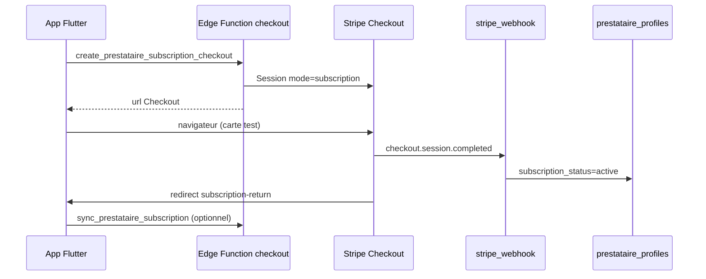

# Abonnement prestataire — Stripe (configuration + tests)

Guide détaillé pour créer les prix dans Stripe, brancher Supabase, et tester en **mode test** (`pk_test_` / `sk_test_`).

> Les réservations client utilisent déjà Stripe (Connect + PaymentIntent). L’abonnement prestataire est un **second flux** : facturation **plateforme → prestataire** via **Stripe Checkout** (page hébergée Stripe), pas la PaymentSheet de l’app.

---

## Avant de commencer

| Élément | Où le trouver |
|---------|----------------|
| Mode test Stripe | Interrupteur **« Test mode »** en haut à droite du [Dashboard](https://dashboard.stripe.com/test/dashboard) — doit être **activé** (fond orange / libellé « Test »). |
| Clé publique app | `.env` → `STRIPE_PUBLISHABLE_KEY=pk_test_...` |
| Clé secrète serveur | Supabase secrets → `STRIPE_SECRET_KEY=sk_test_...` (**jamais** dans Flutter) |
| Projet Supabase | Ex. `vjjasrdoyguqkftfhaei` → URL functions `https://<ref>.supabase.co/functions/v1/...` |

Tout ce que tu crées dans Stripe avec le mode test activé aura des identifiants `price_...` / `prod_...` **test** : ils ne fonctionnent qu’avec `sk_test_`.

---

## Partie 1 — Créer les produits et prix dans Stripe

MadBeauty attend **4 prix récurrents** (abonnements), pas 4 produits obligatoirement séparés — tu peux regrouper en 2 produits (solo / multi) ou 1 seul produit avec 4 prix.

### Option recommandée : 2 produits, 4 prix

#### Produit 1 — Palier « 1 service »

1. Dashboard (mode test) → **Product catalog** → **Products** → **+ Add product**
2. Renseigne :
   - **Name** : `MadBeauty Pro — 1 service`
   - **Description** (optionnel) : abonnement pour 1 service publié
3. Dans **Pricing**, ajoute **deux** prix :

| Champ | Prix mensuel | Prix annuel |
|-------|--------------|-------------|
| **Pricing model** | Standard pricing | Standard pricing |
| **Price** | `14,99` EUR | `150,00` EUR |
| **Billing period** | Monthly | Yearly |
| **Type** | Recurring | Recurring |

4. **Save product**
5. Ouvre chaque prix créé → copie l’**API ID** (commence par `price_...`) :
   - → `STRIPE_PRICE_SOLO_MONTHLY`
   - → `STRIPE_PRICE_SOLO_YEARLY`

#### Produit 2 — Palier « 2 services ou plus »

1. **+ Add product**
2. **Name** : `MadBeauty Pro — 2+ services`
3. Deux prix récurrents :

| | Mensuel | Annuel |
|---|---------|--------|
| Montant | `17,99` EUR | `180,00` EUR |
| Période | Monthly | Yearly |

4. Copie les API ID :
   - → `STRIPE_PRICE_MULTI_MONTHLY`
   - → `STRIPE_PRICE_MULTI_YEARLY`

### Vérification dans Stripe

**Product catalog → Prices** : tu dois voir 4 lignes en **Recurring**, devise **EUR**, avec les bons montants.

> Les montants affichés dans l’app (`14,99 €`, `150 €`, etc.) viennent du code (`prestataire_subscription_config.dart`). Stripe facture ce que tu as saisi dans le Dashboard — garde les mêmes chiffres pour éviter la confusion en test.

---

## Partie 2 — Customer portal (gestion / résiliation)

Sans cette étape, le bouton **« Gérer la facturation »** (abonnement déjà actif) peut échouer.

1. Dashboard → **Settings** (engrenage) → **Billing** → **Customer portal**
2. **Activate** / **Turn on** le portail
3. Coche au minimum :
   - **Update payment method**
   - **View invoice history**
   - **Cancel subscription** (utile en test)
4. **Save** les paramètres par défaut

Tu peux laisser l’URL de retour par défaut ; l’app envoie une `return_url` à chaque ouverture du portail.

---

## Partie 3 — Webhook Stripe (synchroniser l’abonnement en base)

L’app lit le statut dans `prestataire_profiles` (`subscription_status`, etc.). C’est le webhook qui met à jour ces colonnes après paiement.

### Si tu as déjà un endpoint `stripe_webhook`

1. **Developers** → **Webhooks** → clique ton endpoint existant  
   (`https://<ref>.supabase.co/functions/v1/stripe_webhook`)
2. **+ Add events** (ou **Update** → **Select events**)
3. Ajoute **en plus** des événements réservation / Connect :

| Événement | Rôle |
|-----------|------|
| `checkout.session.completed` | Fin du Checkout abonnement → enregistre l’abonnement |
| `customer.subscription.created` | Création abonnement |
| `customer.subscription.updated` | Renouvellement, changement de statut |
| `customer.subscription.deleted` | Résiliation |

4. **Save**

Le **Signing secret** (`whsec_...`) ne change pas si tu modifies seulement la liste d’événements sur le même endpoint.

### Si tu crées un nouvel endpoint

Même URL, tous les événements réservation **+** abonnement listés dans `docs/STRIPE_CONNECT_SETUP.md` § 6 **+** les 4 ci-dessus.

Puis :

```bash
npx supabase secrets set STRIPE_WEBHOOK_SECRET=whsec_...
npx supabase functions deploy stripe_webhook --no-verify-jwt
```

---

## Partie 4 — Secrets Supabase (les 4 price ID)

Remplace par tes vrais `price_...` **mode test** :

```bash
npx supabase login
npx supabase secrets set STRIPE_PRICE_SOLO_MONTHLY=price_xxxxxxxx
npx supabase secrets set STRIPE_PRICE_SOLO_YEARLY=price_xxxxxxxx
npx supabase secrets set STRIPE_PRICE_MULTI_MONTHLY=price_xxxxxxxx
npx supabase secrets set STRIPE_PRICE_MULTI_YEARLY=price_xxxxxxxx
```

Vérifie :

```bash
npx supabase secrets list
```

(`STRIPE_SECRET_KEY` et `STRIPE_WEBHOOK_SECRET` doivent déjà être présents.)

---

## Partie 5 — Base de données + déploiement des functions

```bash
npx supabase db push
npx supabase functions deploy create_prestataire_subscription_checkout
npx supabase functions deploy create_prestataire_billing_portal
npx supabase functions deploy sync_prestataire_subscription
npx supabase functions deploy stripe_webhook --no-verify-jwt
npx supabase functions deploy stripe_connect_redirect --no-verify-jwt
```

La migration `20260601180000_prestataire_stripe_subscription.sql` ajoute les colonnes abonnement sur `prestataire_profiles`.

---

## Partie 6 — Tester en mode test (bout en bout)

### Prérequis app

```bash
flutter run --dart-define-from-file=.env
```

- Compte **prestataire** connecté (pas invité).
- Au moins **1 service** publié dans le catalogue (pour le palier solo).
- `STRIPE_PUBLISHABLE_KEY` = `pk_test_...` dans `.env`.

### Scénario 1 — Première souscription (mensuel, 1 service)

1. App → **Profil prestataire** → **Mon abonnement**  
   (ou étape abonnement du hub onboarding / complétion profil).
2. Vérifie **Ton palier actuel** : « 1 service » si tu n’as qu’un service publié.
3. Laisse **Mensuel** sélectionné → **S’abonner (mensuel)**.
4. Le navigateur s’ouvre sur **Stripe Checkout** (page Stripe, pas l’app).
5. Paiement test :
   - **E-mail** : n’importe quel e-mail valide
   - **Carte** : `4242 4242 4242 4242`
   - **Date** : n’importe quelle date **future** (ex. `12/34`)
   - **CVC** : `123`
   - **Nom** : texte libre
6. Valide → redirection → page « Retour MadBeauty » → l’app s’ouvre sur **Mon abonnement**.
7. Snackbar : *« Merci ! Ton abonnement sera actif dans quelques secondes. »*
8. Appuie sur **Actualiser le statut** si besoin → bandeau vert **Abonnement actif**.

### Scénario 2 — Palier multi (2+ services)

1. Publie un **2ᵉ service** dans ton catalogue.
2. Retourne sur **Mon abonnement** : palier attendu **2 services ou plus**.
3. Si tu avais déjà un abonnement solo actif, l’app propose le **portail** plutôt qu’un nouvel achat — en test, tu peux résilier dans le portail puis resouscrire au palier multi, ou utiliser un autre compte prestataire test.

### Scénario 3 — Annuel

Même flux avec l’onglet **Annuel** → **S’abonner (annuel)**. Checkout affiche le montant annuel (150 € ou 180 € selon palier).

### Scénario 4 — Gérer / résilier

1. Avec abonnement actif → **Gérer la facturation**.
2. Portail Stripe test → annuler l’abonnement ou changer la carte.
3. Retour app → **Actualiser le statut**.

### Scénario 5 — Cartes de test utiles

| Numéro | Résultat |
|--------|----------|
| `4242 4242 4242 4242` | Paiement OK |
| `4000 0000 0000 0002` | Carte refusée |
| `4000 0025 0000 3155` | 3D Secure (suivre l’invite Stripe) |

Même règles que `docs/STRIPE_TEST_FLOW.md` § cartes.

### Vérifier côté Stripe Dashboard

**Mode test** → **Customers** : un client `cus_...` avec metadata `prestataire_id`.

**Subscriptions** : abonnement `sub_...` **Active**, bon prix (14,99 €/mois ou autre).

**Developers → Webhooks** → ton endpoint → **Recent deliveries** : événements `checkout.session.completed` et `customer.subscription.updated` en **200**.

### Vérifier côté Supabase (SQL Editor)

Remplace `<user_id>` par l’UUID Auth du prestataire test :

```sql
select
  id,
  nom_salon,
  stripe_billing_customer_id,
  stripe_subscription_id,
  subscription_status,
  subscription_tier,
  subscription_interval,
  subscription_current_period_end
from prestataire_profiles
where user_id = '<user_id>';
```

| Champ | Après paiement réussi |
|-------|------------------------|
| `subscription_status` | `active` (ou `trialing` si tu ajoutes un essai Stripe plus tard) |
| `subscription_tier` | `solo` ou `multi` |
| `subscription_interval` | `month` ou `year` |
| `stripe_subscription_id` | `sub_...` |
| `stripe_billing_customer_id` | `cus_...` |

### Vérifier les logs si ça bloque

Le CLI Supabase (v2.104+) n’expose plus `supabase functions logs`. Utilise le **Dashboard** :

1. [Dashboard](https://supabase.com/dashboard/project/vjjasrdoyguqkftfhaei/functions) → **Edge Functions**
2. Ouvre `create_prestataire_subscription_checkout` ou `stripe_webhook`
3. Onglet **Logs** ou **Invocations** (erreurs Stripe, `console.error`, statut HTTP)

En local : `npx supabase functions serve` affiche les `console.log` dans le terminal.

| Symptôme | Cause fréquente |
|----------|-----------------|
| « Paiement non configuré sur le serveur » | Un des `STRIPE_PRICE_*` manquant ou pas un `price_...` |
| « Palier incorrect » | 2 services publiés mais tu forces solo (l’app choisit le palier selon le catalogue) |
| « Abonnement déjà actif » | Normal → utiliser **Gérer la facturation** |
| Statut reste `none` après paiement | Webhook non reçu : vérifier URL, secret, événements, deploy `stripe_webhook` |
| Navigateur ne revient pas à l’app | Tester sur **appareil réel** ; émulateur + deep link `subscription-return` parfois capricieux |

---

## Partie 7 — Flux technique (pour comprendre)



- **Passer pour l’instant** (onboarding) : aucun appel Stripe — statut reste `none`.
- **Publication catalogue** : métier futur possible (exiger `subscription_status = active`) — pas forcé dans cette version.

---

## Partie 8 — Passer en production (plus tard)

1. Désactiver le mode test dans Stripe → recréer les **4 prix en live** (`price_...` live).
2. Remplacer `sk_live_`, `pk_live_`, `whsec_` live dans secrets / `.env`.
3. Re-tester un vrai petit montant ou un abonnement live annulé immédiatement.

---

## Liens

- [Stripe — Testing](https://docs.stripe.com/testing)
- [Stripe — Checkout subscriptions](https://docs.stripe.com/billing/subscriptions/build-subscriptions?ui=checkout)
- Réservations + Connect : `docs/STRIPE_CONNECT_SETUP.md`, `docs/STRIPE_TEST_FLOW.md`
- Modèle tarifaire produit : `docs/MODELE_TARIFAIRE.md`
