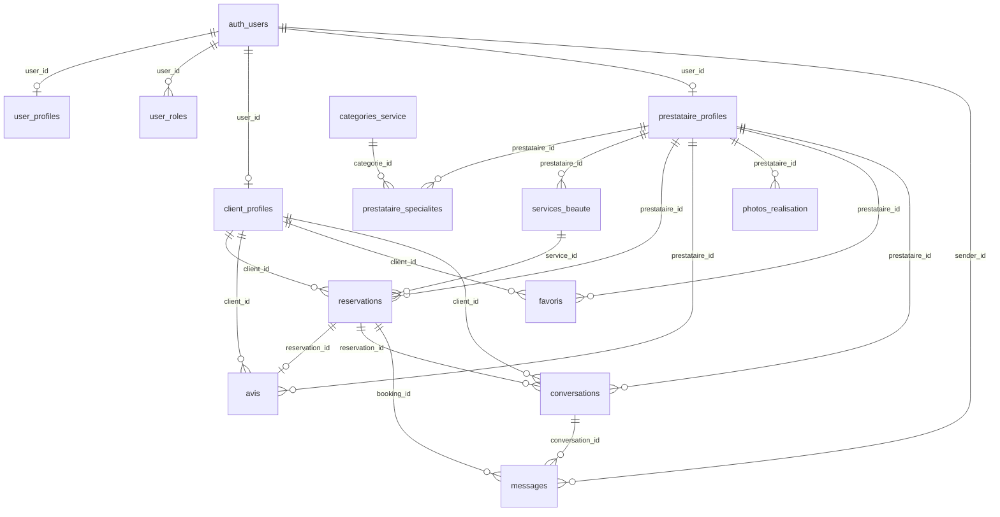

# Schéma base de données MadBeauty (Supabase / PostgreSQL)

Référence des tables **`public`**, colonnes, relations et **Row Level Security (RLS)** après application des migrations du dépôt.

> Ordre d’application : migrations dans `supabase/migrations/` (chronologique). Doc à aligner après changements structurels notables.

---

## Types énumérés

| Type | Valeurs |
|------|---------|
| `public.app_role` | `client`, `prestataire` |

---

## Tables auth / profil global

### `auth.users` (schéma Supabase, non listé ici en détail)

Référence standard Supabase : `id`, `email`, métadonnées, etc.

### `public.user_profiles`

Profil identité (1:1 avec `auth.users`). Remplace l’ancienne table `profiles` après migration `20260510120000`.

| Colonne | Type | Contraintes |
|---------|------|-------------|
| `id` | `uuid` | PK, `default gen_random_uuid()` |
| `user_id` | `uuid` | NOT NULL, UNIQUE, FK → `auth.users(id)` ON DELETE CASCADE |
| `nom` | `text` | nullable |
| `prenom` | `text` | nullable |
| `avatar_url` | `text` | nullable |
| `telephone` | `text` | nullable |
| `fcm_token` | `text` | nullable — token device Firebase (notifications push) |
| `fcm_token_updated_at` | `timestamptz` | nullable — dernière mise à jour du token FCM |
| `updated_at` | `timestamptz` | NOT NULL, default `now()` ; trigger `set_updated_at` |

**Index** : `idx_user_profiles_fcm_nonnull` sur `(user_id)` où `fcm_token IS NOT NULL`.

**Trigger** : `trg_user_profiles_updated_at` → `public.set_updated_at()`.

### `public.user_roles`

Rôles applicatifs (multi-rôle par utilisateur).

| Colonne | Type | Contraintes |
|---------|------|-------------|
| `user_id` | `uuid` | PK (composite), FK → `auth.users(id)` ON DELETE CASCADE |
| `role` | `app_role` | PK (composite) |
| `created_at` | `timestamptz` | NOT NULL, default `now()` |

**Trigger auth** : `handle_new_user` sur `auth.users` insère une ligne `user_profiles`, le rôle `client` dans `user_roles` et une ligne `client_profiles`.

**Trigger rôle** : `trg_user_roles_ensure_profile` sur `user_roles` crée automatiquement le profil métier associé au rôle ajouté (`client_profiles` pour `client`, `prestataire_profiles` pour `prestataire`).

---

## Profils métier client / prestataire

### `public.client_profiles`

| Colonne | Type | Contraintes |
|---------|------|-------------|
| `id` | `uuid` | PK |
| `user_id` | `uuid` | NOT NULL, UNIQUE, FK → `auth.users(id)` ON DELETE CASCADE |
| `adresse` | `text` | nullable — adresse formatée complète |
| `ville` | `text` | nullable |
| `code_postal` | `text` | nullable |
| `pays` | `char(2)` | nullable — code ISO 3166-1 alpha-2 |
| `voie_type` | `text` | nullable |
| `voie_nom` | `text` | nullable |
| `numero_rue` | `text` | nullable |
| `latitude` | `double precision` | nullable |
| `longitude` | `double precision` | nullable |
| `stripe_customer_id` | `text` | nullable — client Stripe (`cus_...`) pour PaymentSheet |
| `loyalty_points` | `integer` | NOT NULL, default 0 — solde points fidélité |
| `loyalty_points_earned_total` | `integer` | NOT NULL, default 0 — total gagné (badges) |
| `loyalty_rewards_redeemed` | `integer` | NOT NULL, default 0 — séances offertes utilisées |
| `created_at` | `timestamptz` | NOT NULL, default `now()` |

### `public.loyalty_ledger`

Historique des mouvements de points (+2 earn / −200 redeem).

| Colonne | Type | Contraintes |
|---------|------|-------------|
| `id` | `uuid` | PK |
| `client_id` | `uuid` | NOT NULL, FK → `client_profiles` |
| `reservation_id` | `uuid` | nullable, FK → `reservations` |
| `delta_points` | `integer` | NOT NULL, ≠ 0 |
| `kind` | `text` | `earn` \| `redeem` \| `adjust` |
| `balance_after` | `integer` | NOT NULL |
| `created_at` | `timestamptz` | NOT NULL, default `now()` |

**RPC** : `get_my_loyalty_info()` — solde, progression, badges.

### `public.prestataire_profiles`

| Colonne | Type | Contraintes |
|---------|------|-------------|
| `id` | `uuid` | PK |
| `user_id` | `uuid` | NOT NULL, UNIQUE, FK → `auth.users(id)` ON DELETE CASCADE |
| `nom_salon` | `text` | nullable |
| `bio` | `text` | nullable |
| `ville` | `text` | nullable |
| `latitude` | `double precision` | nullable |
| `longitude` | `double precision` | nullable |
| `note_moyenne` | `double precision` | nullable — recalculée automatiquement depuis `avis` (trigger) |
| `public_slug` | `text` | unique — lien court `https://madbeauty.pro/@slug` |
| `is_verified` | `boolean` | NOT NULL, default `false` |
| `stripe_connect_account_id` | `text` | nullable — compte Connect Express (`acct_...`) |
| `stripe_connect_onboarding_status` | `text` | NOT NULL, default `'not_started'` — `not_started`, `pending`, `complete`, `restricted` |
| `stripe_connect_charges_enabled` | `boolean` | NOT NULL, default `false` |
| `stripe_connect_payouts_enabled` | `boolean` | NOT NULL, default `false` |
| `stripe_connect_details_submitted` | `boolean` | NOT NULL, default `false` |
| `stripe_connect_updated_at` | `timestamptz` | nullable — dernière synchro webhook / `prestataire_connect_sync` |
| `stripe_billing_customer_id` | `text` | nullable — customer Billing (`cus_...`) pour abonnement |
| `stripe_subscription_id` | `text` | nullable, unique si renseigné — `sub_...` |
| `subscription_status` | `text` | NOT NULL, default `'none'` — `none`, `active`, `trialing`, `past_due`, `canceled`, … |
| `subscription_tier` | `text` | nullable — `solo` \| `multi` |
| `subscription_interval` | `text` | nullable — `month` \| `year` |
| `subscription_current_period_end` | `timestamptz` | nullable |
| `subscription_updated_at` | `timestamptz` | nullable |
| `created_at` | `timestamptz` | NOT NULL, default `now()` |

**Index** : `idx_prestataire_profiles_ville` sur `ville` ; unique partiel sur `stripe_subscription_id` ; unique sur `public_slug`.

**Partage** : liens courts `madbeauty.pro/@{public_slug}` — voir [../product/PRESTATAIRE_SHARE.md](../product/PRESTATAIRE_SHARE.md). RPC `resolve_prestataire_public_ref`.

**Paiements** : le prestataire doit avoir `stripe_connect_account_id` renseigné et `stripe_connect_charges_enabled = true` pour accepter les réservations payantes (voir [../payments/CONNECT.md](../payments/CONNECT.md)). Abonnement : [../payments/SUBSCRIPTION.md](../payments/SUBSCRIPTION.md).

---

## Catalogue

### `public.categories_service`

| Colonne | Type | Contraintes |
|---------|------|-------------|
| `id` | `uuid` | PK |
| `nom` | `text` | NOT NULL |
| `icone` | `text` | nullable |

### `public.prestataire_specialites`

Table de liaison **prestataire ↔ catégorie**.

| Colonne | Type | Contraintes |
|---------|------|-------------|
| `prestataire_id` | `uuid` | PK (composite), FK → `prestataire_profiles(id)` ON DELETE CASCADE |
| `categorie_id` | `uuid` | PK (composite), FK → `categories_service(id)` ON DELETE CASCADE |

### `public.services_beaute`

| Colonne | Type | Contraintes |
|---------|------|-------------|
| `id` | `uuid` | PK |
| `prestataire_id` | `uuid` | NOT NULL, FK → `prestataire_profiles(id)` ON DELETE CASCADE |
| `nom` | `text` | NOT NULL |
| `duree_minutes` | `integer` | NOT NULL, `> 0` |
| `prix` | `numeric(12,2)` | NOT NULL, `>= 0` |
| `is_actif` | `boolean` | NOT NULL, default `true` |

**Index** : `idx_services_beaute_prestataire` sur `prestataire_id`.

### `public.produits_boutique`

Produits physiques vendus par un prestataire (onglet Boutique).

| Colonne | Type | Contraintes |
|---------|------|-------------|
| `id` | `uuid` | PK |
| `prestataire_id` | `uuid` | NOT NULL, FK → `prestataire_profiles(id)` ON DELETE CASCADE |
| `nom` | `text` | NOT NULL, longueur 1–120 |
| `description` | `text` | nullable |
| `conditionnement` | `text` | nullable — ex. `250 ml` |
| `categorie` | `text` | NOT NULL, default `autre` — `cheveux` \| `visage` \| `corps` \| `accessoires` \| `autre` |
| `prix` | `numeric(12,2)` | NOT NULL, `>= 0` |
| `image_url` | `text` | nullable |
| `is_actif` | `boolean` | NOT NULL, default `true` |
| `stock_illimite` | `boolean` | NOT NULL, default `false` — si `true`, pas de suivi de stock |
| `stock_qty` | `integer` | NOT NULL, `>= 0`, default `0` — quantité dispo si non illimité |
| `created_at` | `timestamptz` | NOT NULL |
| `updated_at` | `timestamptz` | NOT NULL |

**Stock** : décrément atomique à la création de commande (`create_boutique_commande_from_cart`) ; restauration si `statut → canceled` (trigger + flag `boutique_commandes.stock_restored`).

**Index** : `(prestataire_id, is_actif)` ; partiel `(prestataire_id, categorie)` si actif.

**RLS** : lecture anon/authenticated si actif + catalogue visible (ou propriétaire) ; write owner.

### `public.packs_offre`

Packs / offres composés de services et/ou produits (créés par le prestataire).

| Colonne | Type | Contraintes |
|---------|------|-------------|
| `id` | `uuid` | PK |
| `prestataire_id` | `uuid` | NOT NULL, FK → `prestataire_profiles(id)` ON DELETE CASCADE |
| `titre` | `text` | NOT NULL, longueur 1–120 |
| `description` | `text` | nullable |
| `image_url` | `text` | nullable |
| `prix_pack` | `numeric(12,2)` | NOT NULL, `>= 0` |
| `is_offre_du_jour` | `boolean` | NOT NULL, default `false` |
| `is_actif` | `boolean` | NOT NULL, default `false` (brouillon jusqu’à composition) |
| `starts_at` / `ends_at` | `timestamptz` | nullable |
| `created_at` / `updated_at` | `timestamptz` | NOT NULL |

**Règle** : un pack actif doit avoir **≥ 2** `pack_items` (trigger).

### `public.pack_items`

| Colonne | Type | Contraintes |
|---------|------|-------------|
| `id` | `uuid` | PK |
| `pack_id` | `uuid` | NOT NULL, FK → `packs_offre(id)` ON DELETE CASCADE |
| `item_type` | `text` | `service` \| `produit` |
| `service_id` | `uuid` | nullable, FK → `services_beaute` |
| `produit_id` | `uuid` | nullable, FK → `produits_boutique` |
| `quantite` | `integer` | NOT NULL, `> 0`, default 1 |
| `sort_order` | `integer` | NOT NULL, default 0 |

**Check** : exactement une référence selon `item_type` ; même `prestataire_id` que le pack (trigger).

### `public.boutique_commandes`

Commandes de produits boutique (paiement Stripe Web ou à régler sur place).

| Colonne | Type | Contraintes |
|---------|------|-------------|
| `id` | `uuid` | PK |
| `client_id` | `uuid` | NOT NULL, FK → `client_profiles` |
| `prestataire_id` | `uuid` | NOT NULL, FK → `prestataire_profiles` |
| `statut` | `text` | `pending_payment` \| `paid` \| `preparing` \| `ready` \| `completed` \| `canceled` \| `pay_on_site` |
| `payment_status` | `text` | `unpaid` \| `pending` \| `paid` \| `failed` \| `refunded` |
| `amount_cents` | `integer` | NOT NULL, `> 0` |
| `currency` | `text` | default `eur` |
| `stripe_payment_intent_id` | `text` | unique nullable |
| `fulfillment` | `text` | `pickup` \| `hand_delivery` |
| `notes_client` | `text` | nullable |
| `stock_restored` | `boolean` | NOT NULL, default `false` — idempotence restauration stock |
| `reservation_id` | `uuid` | nullable, UNIQUE, FK → `reservations` — commande liée à un checkout pack |
| `pack_id` | `uuid` | nullable, FK → `packs_offre` |
| `created_at` / `paid_at` / `updated_at` | `timestamptz` | |

**Flux remise** : prestataire avance jusqu’à `ready` ; le **client** confirme la réception (`ready` → `completed`) via RPC `client_confirm_boutique_receipt`, puis peut publier un avis (`avis_boutique`).

**Admin (support / litige)** :
- `admin_set_boutique_order_statut(uuid, text, text)` — force un statut (motif + audit)
- `admin_confirm_boutique_receipt(uuid, text)` — confirme la réception à la place du client
- `admin_list_avis_boutique` / `admin_delete_avis_boutique` — modération des avis produits

**RPC** : `create_boutique_commande_from_cart(jsonb)` — création + décrément stock (authenticated).  
**RPC pack** : `create_pack_booking(jsonb)` — réservation pack atomique (créneau durée cumulée + snapshot `reservation_pack_items` + commande boutique liée amount 0 + stock).  
**RPC client** : `client_confirm_boutique_receipt(uuid)` — confirmation réception.  
**RPC avis** : `create_avis_boutique(jsonb)` — 1 avis / commande après `completed`.

### `public.avis_boutique`

Avis client sur une commande boutique (après confirmation de réception).

| Colonne | Type | Contraintes |
|---------|------|-------------|
| `id` | `uuid` | PK |
| `commande_id` | `uuid` | NOT NULL, UNIQUE, FK → `boutique_commandes` CASCADE |
| `client_id` | `uuid` | NOT NULL, FK → `client_profiles` |
| `prestataire_id` | `uuid` | NOT NULL, FK → `prestataire_profiles` |
| `note` | `integer` | 1–5 |
| `commentaire` | `text` | nullable |
| `created_at` / `updated_at` | `timestamptz` | |

### `public.reservation_pack_items`

Snapshot des lignes d’un pack au moment de la réservation.

| Colonne | Type | Contraintes |
|---------|------|-------------|
| `reservation_id` | `uuid` | FK → `reservations` CASCADE |
| `item_type` | `text` | `service` \| `produit` |
| `service_id` / `produit_id` | `uuid` | selon type |
| `quantite` | `integer` | `> 0` |
| `label` | `text` | snapshot nom |
| `unit_price_cents` | `integer` | `>= 0` |
| `sort_order` | `integer` | |

**Helpers** : `count_overlapping_reservations`, `slot_fits_disponibilite`, `slot_capacity_at`.

**RLS identité client** : un prestataire peut lire `client_profiles` / `user_profiles` d’un client s’il a une réservation, une conversation **ou une commande boutique** avec ce client (`prestataire_has_boutique_order_with_client`).

**Push / expire** : triggers `boutique_order_*_push` → Edge `on_boutique_order_created` / `on_boutique_order_updated` ; `expire_stale_boutique_pending_orders` (service_role, 2 h) + `expire_own_stale_boutique_pending_orders` (client) — l’annulation restaure le stock via trigger.

**Admin** : RPCs `admin_list_boutique_orders`, `admin_list_boutique_catalog` (`is_admin_user`).

### `public.boutique_commande_items`

| Colonne | Type | Contraintes |
|---------|------|-------------|
| `id` | `uuid` | PK |
| `commande_id` | `uuid` | FK → `boutique_commandes` CASCADE |
| `produit_id` | `uuid` | nullable FK → `produits_boutique` |
| `nom_snapshot` / `conditionnement_snapshot` | `text` | |
| `prix_cents` | `integer` | `>= 0` |
| `quantite` | `integer` | `> 0` |

---

## Disponibilités prestataire

### `public.disponibilites`

Plages horaires **récurrentes** (base des créneaux réservables côté app).

| Colonne | Type | Contraintes |
|---------|------|-------------|
| `id` | `uuid` | PK, `default gen_random_uuid()` |
| `prestataire_id` | `uuid` | NOT NULL, FK → `prestataire_profiles(id)` ON DELETE CASCADE |
| `jour_semaine` | `smallint` | NOT NULL, `0`–`6` (`0` = dimanche, convention PostgreSQL `DOW`) |
| `heure_debut` | `time` | NOT NULL |
| `heure_fin` | `time` | NOT NULL, `heure_fin > heure_debut` |

**Index** : `prestataire_id`, `(prestataire_id, jour_semaine)`.

Plusieurs lignes par jour possibles (ex. matin + après-midi).

### `public.indisponibilites`

Fermetures **ponctuelles** (congés, jour off).

| Colonne | Type | Contraintes |
|---------|------|-------------|
| `id` | `uuid` | PK, `default gen_random_uuid()` |
| `prestataire_id` | `uuid` | NOT NULL, FK → `prestataire_profiles(id)` ON DELETE CASCADE |
| `date_debut` | `timestamptz` | NOT NULL |
| `date_fin` | `timestamptz` | NOT NULL, `date_fin > date_debut` |

**Index** : `prestataire_id`, `(prestataire_id, date_debut, date_fin)`.

---

## Réservations, avis, médias, favoris

### `public.reservations`

| Colonne | Type | Contraintes |
|---------|------|-------------|
| `id` | `uuid` | PK |
| `client_id` | `uuid` | NOT NULL, FK → `client_profiles(id)` ON DELETE CASCADE |
| `prestataire_id` | `uuid` | NOT NULL, FK → `prestataire_profiles(id)` ON DELETE CASCADE |
| `service_id` | `uuid` | NOT NULL, FK → `services_beaute(id)` ON DELETE RESTRICT — pour un pack : premier service (compat agenda/avis) |
| `pack_id` | `uuid` | nullable, FK → `packs_offre(id)` ON DELETE RESTRICT |
| `duration_minutes` | `integer` | NOT NULL, `> 0` — durée bloquée du créneau (pack = somme services) |
| `date_heure` | `timestamptz` | NOT NULL |
| `statut` | `text` | NOT NULL, default `'en_attente'` — voir valeurs courantes ci-dessous |
| `notes_client` | `text` | nullable |
| `notes_prestataire` | `text` | nullable (motif de refus, note pro) |
| `amount_cents` | `integer` | nullable, `>= 0` — montant payé (centimes) |
| `currency` | `text` | default `'eur'` |
| `stripe_payment_intent_id` | `text` | nullable, UNIQUE si renseigné |
| `payment_status` | `text` | nullable — `authorized`, `captured`, `failed`, `canceled` |
| `paid_at` | `timestamptz` | nullable — autorisation ou capture selon le flux |
| `vip_discount_percent` | `smallint` | nullable — remise VIP salon (ex. 5) snapshot checkout |
| `created_at` | `timestamptz` | NOT NULL, default `now()` |

**Valeurs `statut` (app)** : `en_attente`, `confirmee`, `terminee`, `annulee` (variantes anglaises possibles en lecture).

**Cycle paiement Stripe (capture manuelle)** :

| Moment | `statut` | `payment_status` |
|--------|----------|------------------|
| Après PaymentSheet + `complete_booking_after_payment` | `en_attente` | `authorized` |
| Prestataire confirme | `confirmee` | `authorized` |
| Prestataire termine + `capture_booking_payment` | `terminee` | `captured` |

**Index** : `date_heure`, `client_id`, `prestataire_id`, `idx_reservations_stripe_payment_intent` (unique partiel sur `stripe_payment_intent_id`).

### `public.client_prestataire_relations`

Relation client ↔ salon : compteur de RDV `terminee` + statut VIP (≥ 3).

| Colonne | Type | Contraintes |
|---------|------|-------------|
| `client_id` | `uuid` | PK composite, FK → `client_profiles` |
| `prestataire_id` | `uuid` | PK composite, FK → `prestataire_profiles` |
| `completed_count` | `integer` | NOT NULL, `>= 0` |
| `is_vip` | `boolean` | NOT NULL |
| `vip_since` | `timestamptz` | nullable |
| `updated_at` | `timestamptz` | NOT NULL |

**Trigger** : `trg_sync_client_presta_relation_on_terminee` — upsert au passage `statut → terminee`.  
**RPC** : `is_client_vip_at_prestataire(client, presta)`.

### `public.scheduled_pushes`

File FCM planifiée (aftercare J+1, rappels rebook). Traitée par Edge `process_scheduled_pushes` (cron ~15 min).

| Colonne | Type | Notes |
|---------|------|-------|
| `type` | `text` | `aftercare` \| `rebook_reminder` |
| `send_at` | `timestamptz` | |
| `status` | `text` | `pending` \| `sent` \| `cancelled` \| `failed` |
| `client_id` / `prestataire_id` / `reservation_id` | `uuid` | |
| `payload` | `jsonb` | |

**Trigger aftercare** : `trg_schedule_aftercare_on_terminee` — insert `send_at = now() + 24h` au passage `terminee`.

### `public.booking_rebook_reminders`

Rappels « me rappeler dans 4 / 6 semaines » (pas de série auto). RPC client `schedule_rebook_reminder(reservation_id, interval_weeks)`.

### `public.avis`

Un avis par réservation (`reservation_id` unique). Réservé aux réservations **terminées** (contrôle trigger + app).

| Colonne | Type | Contraintes |
|---------|------|-------------|
| `id` | `uuid` | PK |
| `client_id` | `uuid` | NOT NULL, FK → `client_profiles(id)` ON DELETE CASCADE |
| `prestataire_id` | `uuid` | NOT NULL, FK → `prestataire_profiles(id)` ON DELETE CASCADE |
| `reservation_id` | `uuid` | NOT NULL, UNIQUE, FK → `reservations(id)` ON DELETE CASCADE |
| `note` | `integer` | NOT NULL, `CHECK (note >= 1 AND note <= 5)` |
| `commentaire` | `text` | nullable |
| `created_at` | `timestamptz` | NOT NULL, default `now()` |

**Triggers** :

| Trigger | Rôle |
|---------|------|
| `avis_check_reservation_before_insert` | Avant INSERT : réservation terminée, `client_id` cohérent, renseigne `prestataire_id` |
| **`update_note_moyenne`** | **Après INSERT** : recalcule `prestataire_profiles.note_moyenne` (`avg(note)`) |
| `avis_refresh_note_moyenne` | Après UPDATE/DELETE : même recalcul |

**Vue** `public.reviews` : alias lecture de `avis` (`booking_id` = `reservation_id`).

**App** : `ReviewService` / `reviewsByPrestataireProvider`, `hasReviewedProvider` (Riverpod).

### `public.photos_realisation`

| Colonne | Type | Contraintes |
|---------|------|-------------|
| `id` | `uuid` | PK |
| `prestataire_id` | `uuid` | NOT NULL, FK → `prestataire_profiles(id)` ON DELETE CASCADE |
| `url` | `text` | NOT NULL |
| `caption` | `text` | nullable |
| `categorie_id` | `uuid` | nullable, FK → `categories_service(id)` ON DELETE SET NULL |
| `created_at` | `timestamptz` | NOT NULL, default `now()` |

### `public.reel_posts`

Feed **Reel** (photos/vidéos scrollables, style TikTok).

| Colonne | Type | Notes |
|---------|------|--------|
| `id` | `uuid` | PK |
| `prestataire_id` | `uuid` | FK → `prestataire_profiles` CASCADE |
| `media_type` | `text` | `image` \| `video` — **cover** (1er média) |
| `media_url` | `text` | URL Storage `reel-media` — **cover** |
| `caption` | `text` | nullable ≤ 500 |
| `status` | `text` | `draft` \| `published` \| `hidden` |
| `likes_count` / `comments_count` / `views_count` | `integer` | dénormalisés |
| `created_at` / `updated_at` | `timestamptz` | |

Publication réservée aux prestataires **catalogue-visibles** (`prestataire_is_catalog_visible`). Tables liées : `reel_post_media`, `reel_likes`, `reel_favorites`, `reel_views`, `reel_comments`.

**RPC** : `list_reel_feed` (… + `saved_by_me`), `get_reel_feed_item`, `list_reel_favorites`, `toggle_reel_like`, `toggle_reel_favorite`, `record_reel_view`, `list_reel_comments`, `add_reel_comment`, `delete_reel_comment`.

### `public.reel_post_media`

Galerie d’un Reel (swipe horizontal dans le feed vertical). Max **10** médias / post.

| Colonne | Type | Notes |
|---------|------|--------|
| `id` | `uuid` | PK |
| `reel_id` | `uuid` | FK → `reel_posts` CASCADE |
| `media_type` | `text` | `image` \| `video` |
| `media_url` | `text` | URL Storage `reel-media` |
| `sort_order` | `integer` | ordre d’affichage (≥ 0, unique par reel) |
| `created_at` | `timestamptz` | |

Triggers : limite 10 ; sync du cover `reel_posts.media_url` / `media_type` depuis le 1er média.

### `public.reel_favorites`

Bookmarks client sur les Reels (distinct des likes).

| Colonne | Type | Notes |
|---------|------|--------|
| `reel_id` | `uuid` | PK composite, FK → `reel_posts` CASCADE |
| `client_id` | `uuid` | PK composite, FK → `client_profiles` CASCADE |
| `created_at` | `timestamptz` | |

**RPC** : `toggle_reel_favorite`, `list_reel_favorites`.

### `public.reel_comments`

Commentaires clients sur un Reel (UI type TikTok).

| Colonne | Type | Contraintes |
|---------|------|-------------|
| `id` | `uuid` | PK |
| `reel_id` | `uuid` | NOT NULL, FK → `reel_posts(id)` ON DELETE CASCADE |
| `client_id` | `uuid` | NOT NULL, FK → `client_profiles(id)` ON DELETE CASCADE |
| `body` | `text` | 1–500 caractères |
| `created_at` | `timestamptz` | NOT NULL, default `now()` |

**Triggers** : sync `comments_count` ; rate-limit soft 40 commentaires / jour / client.

### `public.favoris`

| Colonne | Type | Contraintes |
|---------|------|-------------|
| `client_id` | `uuid` | PK (composite), FK → `client_profiles(id)` ON DELETE CASCADE |
| `prestataire_id` | `uuid` | PK (composite), FK → `prestataire_profiles(id)` ON DELETE CASCADE |
| `created_at` | `timestamptz` | NOT NULL, default `now()` |

### `public.wishlist_produits`

Wishlist client sur produits boutique + préférences d’alerte.

| Colonne | Type | Contraintes |
|---------|------|-------------|
| `client_id` | `uuid` | PK (composite), FK → `client_profiles(id)` ON DELETE CASCADE |
| `produit_id` | `uuid` | PK (composite), FK → `produits_boutique(id)` ON DELETE CASCADE |
| `created_at` | `timestamptz` | NOT NULL, default `now()` |
| `alert_on_restock` | `boolean` | NOT NULL, default `true` |
| `alert_on_price_drop` | `boolean` | NOT NULL, default `true` |
| `last_seen_price` | `numeric(12,2)` | NOT NULL — snapshot au moment de l’ajout / après alerte |

**RLS** : client owner (SELECT/INSERT/UPDATE/DELETE).  
**Push** : trigger `trg_wishlist_product_updated_push` sur `produits_boutique` (restock 0→>0 / baisse `prix`) → Edge `on_wishlist_product_updated`.

### `public.booking_disputes`

Litiges réservation (médiation admin). **Pas** de refund Stripe automatique en V1.

| Colonne | Type | Contraintes |
|---------|------|-------------|
| `id` | `uuid` | PK |
| `reservation_id` | `uuid` | NOT NULL, FK → `reservations(id)` ON DELETE CASCADE |
| `client_id` / `prestataire_id` | `uuid` | NOT NULL, FK profils |
| `opened_by` | `text` | `client` \| `prestataire` |
| `reason` | `text` | `no_show` \| `deposit` \| `quality` \| `refund` \| `other` |
| `status` | `text` | `open` \| `under_review` \| `resolved_favor_client` \| `resolved_favor_presta` \| `closed` |
| `amount_cents` | `integer` | nullable (snapshot) |
| `summary` / `admin_notes` / `resolution` | `text` | nullable |
| `created_at` / `updated_at` / `resolved_at` | `timestamptz` | |
| `resolved_by` | `uuid` | nullable, FK → `auth.users` |

**Index** : un seul litige actif (`open` / `under_review`) par `reservation_id`.  
**RPC** : `open_booking_dispute`, `resolve_booking_dispute` (admin).  
**Push** : → Edge `on_dispute_updated`.

### `public.dispute_messages`

Messages du fil de médiation (parties + admin).

| Colonne | Type | Contraintes |
|---------|------|-------------|
| `id` | `uuid` | PK |
| `dispute_id` | `uuid` | NOT NULL, FK → `booking_disputes(id)` ON DELETE CASCADE |
| `sender_user_id` | `uuid` | NOT NULL, FK → `auth.users` |
| `sender_role` | `text` | `client` \| `prestataire` \| `admin` |
| `body` | `text` | 1–4000 caractères |
| `created_at` | `timestamptz` | NOT NULL |

### `public.stripe_webhook_events`

Journal d’idempotence pour les webhooks Stripe (Edge Function `stripe_webhook`). **Pas d’accès client** : RLS activé sans policy → `service_role` uniquement.

| Colonne | Type | Contraintes |
|---------|------|-------------|
| `id` | `text` | PK — id événement Stripe (`evt_...`) |
| `type` | `text` | NOT NULL — ex. `payment_intent.succeeded` |
| `payload` | `jsonb` | nullable — objet événement |
| `processed_at` | `timestamptz` | NOT NULL, default `now()` |

**Index** : `idx_stripe_webhook_events_processed` sur `processed_at DESC`.

---

## Messagerie

Un fil unique par paire **client ↔ prestataire**. Peut être lié à une réservation (`reservation_id` / `booking_id`) ou en mode **inquiry** (devis / conseil hors réservation). Realtime sur `messages`.

### `public.conversations` (métadonnées du fil)

| Colonne | Type | Contraintes |
|---------|------|-------------|
| `id` | `uuid` | PK |
| `client_id` | `uuid` | NOT NULL, FK → `client_profiles(id)` ON DELETE CASCADE |
| `prestataire_id` | `uuid` | NOT NULL, FK → `prestataire_profiles(id)` ON DELETE CASCADE |
| `reservation_id` | `uuid` | nullable, FK → `reservations(id)` ON DELETE CASCADE |
| `kind` | `text` | NOT NULL, default `booking` — `booking` \| `inquiry` |
| `last_message_at` | `timestamptz` | nullable |

**Index** : UNIQUE `(client_id, prestataire_id)` — un fil par paire ; `conversations_reservation_id_uidx` UNIQUE sur `reservation_id` (où non null).

**Index** : `idx_conversations_client_last`, `idx_conversations_prestataire_last` pour l’inbox.

**Inquiry** : messages sans `booking_id` autorisés si `kind = inquiry` (policy `messages_insert_inquiry_participant`) ; rate-limit soft 30 msg / jour / expéditeur (trigger).

### `public.messages`

| Colonne | Type | Contraintes |
|---------|------|-------------|
| `id` | `uuid` | PK |
| `conversation_id` | `uuid` | NOT NULL, FK → `conversations(id)` ON DELETE CASCADE |
| `booking_id` | `uuid` | nullable, FK → `reservations(id)` ON DELETE CASCADE |
| `sender_id` | `uuid` | NOT NULL, FK → `auth.users(id)` ON DELETE CASCADE |
| `content` | `text` | nullable (canonique côté app) |
| `contenu` | `text` | NOT NULL (legacy, synchronisé avec `content`) |
| `image_url` | `text` | nullable |
| `kind` | `text` | NOT NULL, default `text` — `text` \| `image` \| `result_media` |
| `result_label` | `text` | nullable — `before` \| `after` \| `result` si `kind = result_media` |
| `is_read` | `boolean` | NOT NULL, default `false` |
| `created_at` | `timestamptz` | NOT NULL, default `now()` |

**Index** : `idx_messages_conversation` sur `(conversation_id, created_at DESC)` ; `idx_messages_booking_created` sur `(booking_id, created_at ASC)`.

**Triggers** :

| Trigger | Rôle |
|---------|------|
| `messages_sync_content_columns` | Avant INSERT/UPDATE : aligne `content` et `contenu` |
| `messages_set_conversation_from_booking` | Avant INSERT : remplit `conversation_id` / `booking_id` depuis l’autre clé |
| `messages_touch_conversation` | Après INSERT : met à jour `conversations.last_message_at` |

**Realtime** : `replica identity full` ; table ajoutée à `supabase_realtime`.

### `public.booking_conversations` (vue)

Agrégat lecture seule par réservation (dernier message, compteur). `security_invoker = true` ; `GRANT SELECT` à `authenticated`.

| Colonne exposée | Description |
|-----------------|-------------|
| `id` | id du fil `conversations` (si existant) |
| `booking_id` | `reservations.id` |
| `client_id`, `prestataire_id` | participants |
| `last_message_at` | date du dernier message |
| `last_message_content`, `last_sender_id` | aperçu |
| `message_count` | nombre de messages |

### Edge Function `on_message_created`

Webhook **INSERT** sur `public.messages` → FCM vers le **destinataire** (client ou prestataire de la réservation, ≠ `sender_id`). Voir [../notifications/PUSH.md](../notifications/PUSH.md) § messagerie.

---

## Diagramme relationnel (résumé)

Les colonnes Stripe sur `reservations`, `client_profiles` et `prestataire_profiles` ne modifient pas ce diagramme (attributs sur les entités existantes).

---

## RLS (policies)

Toutes les tables listées ci-dessous ont **RLS activé**.

### `user_profiles`

| Policy | Rôle | Commande | Règle |
|--------|------|----------|--------|
| `user_profiles_select_own` | `authenticated` | SELECT | `auth.uid() = user_id` |
| `user_profiles_select_linked_prestataire` | `authenticated` | SELECT | profil identité lié à un `prestataire_profiles` |
| `user_profiles_select_linked_prestataire_anon` | `anon` | SELECT | idem pour le catalogue public |
| `user_profiles_insert_own` | `authenticated` | INSERT | idem `WITH CHECK` |
| `user_profiles_update_own` | `authenticated` | UPDATE | USING + WITH CHECK |

### `user_roles`

| Policy | Commande | Règle |
|--------|----------|--------|
| `user_roles_select_own` | SELECT | `auth.uid() = user_id` |
| `user_roles_insert_own` | INSERT | `WITH CHECK` |
| `user_roles_update_own` | UPDATE | USING + WITH CHECK |
| `user_roles_delete_own` | DELETE | USING |

### `client_profiles`

| Policy | Commande | Règle |
|--------|----------|--------|
| `client_profiles_select_own` | SELECT | `auth.uid() = user_id` |
| `client_profiles_insert_own` | INSERT | `WITH CHECK` |
| `client_profiles_update_own` | UPDATE | USING + WITH CHECK |

### `prestataire_profiles`

| Policy | Rôle | Commande | Règle |
|--------|------|----------|--------|
| `prestataire_profiles_select_authenticated` | `authenticated` | SELECT | `true` |
| `prestataire_profiles_select_anon` | `anon` | SELECT | `true` pour catalogue / fiches publiques |
| `prestataire_profiles_insert_own` | `authenticated` | INSERT | `auth.uid() = user_id` |
| `prestataire_profiles_update_own` | `authenticated` | UPDATE | USING + WITH CHECK |

### `categories_service`

| Policy | Rôle | Commande | Règle |
|--------|------|----------|--------|
| `categories_service_select_authenticated` | `authenticated` | SELECT | `true` |
| `categories_service_select_anon` | `anon` | SELECT | `true` |
| `categories_service_all_service_role` | `service_role` | ALL | `true` |

Les clients **ne peuvent pas** insérer / modifier les catégories via l’API anon/authenticated ; seed / admin via `service_role`.

### `prestataire_specialites`

| Policy | Rôle | Commande | Règle |
|--------|------|----------|--------|
| `prestataire_specialites_select_authenticated` | `authenticated` | SELECT | `true` |
| `prestataire_specialites_select_anon` | `anon` | SELECT | `true` |
| `prestataire_specialites_write_own` | `authenticated` | ALL | ligne liée à un `prestataire_profiles` dont `user_id = auth.uid()` |

### `services_beaute`

| Policy | Rôle | Commande | Règle |
|--------|------|----------|--------|
| `services_beaute_select_authenticated` | `authenticated` | SELECT | `true` |
| `services_beaute_select_anon` | `anon` | SELECT | `true` |
| `services_beaute_write_own` | `authenticated` | ALL | prestataire propriétaire (`user_id = auth.uid()`) |

### `disponibilites`

| Policy | Rôle | Commande | Règle |
|--------|------|----------|--------|
| `disponibilites_select_authenticated` | `authenticated` | SELECT | `true` (clients qui réservent) |
| `disponibilites_write_own` | `authenticated` | ALL | prestataire propriétaire |

### `indisponibilites`

| Policy | Rôle | Commande | Règle |
|--------|------|----------|--------|
| `indisponibilites_select_authenticated` | `authenticated` | SELECT | `true` |
| `indisponibilites_write_own` | `authenticated` | ALL | prestataire propriétaire |

### `reservations`

| Policy | Commande | Règle |
|--------|----------|--------|
| `reservations_select_participant` | SELECT | client ou prestataire de la réservation |
| `reservations_insert_client` | INSERT | `client_id` appartient au client courant |
| `reservations_update_participant` | UPDATE | client ou prestataire participant |

### `avis`

| Policy | Rôle | Commande | Règle |
|--------|------|----------|--------|
| `avis_select_authenticated` | `authenticated` | SELECT | `true` |
| `avis_select_anon` | `anon` | SELECT | `true` pour afficher les avis publics |
| `avis_insert_own_client` | `authenticated` | INSERT | `client_id` = profil client du `auth.uid()` |

(Pas de UPDATE/DELETE explicites : à ajouter si besoin métier.)

### `photos_realisation`

| Policy | Rôle | Commande | Règle |
|--------|------|----------|--------|
| `photos_realisation_select_authenticated` | `authenticated` | SELECT | `true` |
| `photos_realisation_select_anon` | `anon` | SELECT | `true` pour galerie publique |
| `photos_realisation_write_own` | `authenticated` | ALL | prestataire propriétaire |

### `favoris`

| Policy | Commande | Règle |
|--------|----------|--------|
| `favoris_select_own` | SELECT | favori du client courant |
| `favoris_write_own` | ALL | idem |

### `conversations`

| Policy | Commande | Règle |
|--------|----------|--------|
| `conversations_select_participant` | SELECT | client ou prestataire de la conversation |
| `conversations_insert_participant` | INSERT | idem (WITH CHECK) |
| `conversations_update_participant` | UPDATE | idem |

### `messages`

| Policy | Commande | Règle |
|--------|----------|--------|
| `messages_select_booking_participant` | SELECT | client ou prestataire de la réservation (`booking_id`) |
| `messages_insert_booking_participant` | INSERT | `sender_id = auth.uid()` et participant à la réservation |
| `messages_insert_inquiry_participant` | INSERT | `booking_id` null + conversation `kind = inquiry` + participant |
| `messages_update_booking_participant` | UPDATE | participant à la réservation |

### `wishlist_produits` / `booking_disputes` / `dispute_messages`

| Table | Règle |
|-------|--------|
| `wishlist_produits` | client owner CRUD |
| `booking_disputes` | participants SELECT ; ouverture via RPC ; résolution admin |
| `dispute_messages` | participants + admin SELECT/INSERT |

### `stripe_webhook_events`

RLS **activé**, **aucune policy** : lecture/écriture réservées aux Edge Functions (`service_role`).

---

## Edge Functions Stripe (paiements)

| Fonction | Auth | Rôle |
|----------|------|------|
| `create_booking_payment_intent` | JWT client | Crée un PaymentIntent (`capture_method: manual`, Connect) |
| `complete_booking_after_payment` | JWT client | Insère la réservation après PaymentSheet |
| `capture_booking_payment` | JWT prestataire | Capture le PI après prestation `terminee` |
| `prestataire_connect_onboarding` | JWT prestataire | Onboarding Connect Express |
| `prestataire_connect_sync` | JWT prestataire | Met à jour les colonnes `stripe_connect_*` |
| `stripe_webhook` | Signature Stripe | Idempotence + synchro paiements / comptes |

Déploiement et secrets : [../payments/CONNECT.md](../payments/CONNECT.md). Test manuel : [../payments/TEST_FLOW.md](../payments/TEST_FLOW.md).

---

## Supabase Realtime

| Table | Publication | Notes |
|-------|-------------|--------|
| `reservations` | `supabase_realtime` | agenda prestataire |
| `messages` | `supabase_realtime` | chat instantané (`replica identity full`) |
| `prestataire_profiles` | `supabase_realtime` | note moyenne sur fiche prestataire |

---

## Storage

Les buckets sont créés par migrations SQL dans `storage.buckets`.

| Bucket | Public | Taille max | MIME autorisés | Usage |
|--------|--------|------------|----------------|-------|
| `profile-photos` | oui | 5 MiB | `image/jpeg`, `image/png`, `image/webp` | avatars utilisateurs / prestataires |
| `realisation-photos` | oui | 10 MiB | `image/jpeg`, `image/png`, `image/webp` (+ vidéos) | galerie réalisations prestataires |
| `reel-media` | oui | 50 MiB | tous (validés côté app) | photos/vidéos feed Reel |

Policies `storage.objects` :

| Policy | Bucket | Rôle | Commande | Règle |
|--------|--------|------|----------|--------|
| `profile_photos_select_public` | `profile-photos` | `public` | SELECT | lecture publique |
| `profile_photos_insert_own_folder` | `profile-photos` | `authenticated` | INSERT | premier dossier = `auth.uid()` |
| `profile_photos_update_own_folder` | `profile-photos` | `authenticated` | UPDATE | premier dossier = `auth.uid()` |
| `profile_photos_delete_own_folder` | `profile-photos` | `authenticated` | DELETE | premier dossier = `auth.uid()` |
| `realisation_photos_select_public` | `realisation-photos` | `public` | SELECT | lecture publique |
| `realisation_photos_insert_own_prestataire` | `realisation-photos` | `authenticated` | INSERT | premier dossier = `prestataire_profiles.id` appartenant à `auth.uid()` |
| `realisation_photos_update_own_prestataire` | `realisation-photos` | `authenticated` | UPDATE | idem |
| `realisation_photos_delete_own_prestataire` | `realisation-photos` | `authenticated` | DELETE | idem |

---

## Fonctions / triggers partagés

| Objet | Rôle |
|-------|------|
| `public.set_updated_at()` | Met `updated_at` à `now()` (trigger avant UPDATE). |
| `public.handle_new_user()` | Après création `auth.users` : upsert `user_profiles`, rôle `client` dans `user_roles`, création `client_profiles`. |
| `public.ensure_profile_for_user_role()` | Après insertion dans `user_roles` : crée le profil métier associé au rôle (`client_profiles` ou `prestataire_profiles`). |

---

## Lecture invité (`anon`)

Les policies `anon` ouvrent uniquement la lecture du catalogue public :

- `prestataire_profiles`
- `user_profiles` liés à un profil prestataire
- `categories_service`
- `prestataire_specialites`
- `services_beaute`
- `produits_boutique`
- `packs_offre` / `pack_items`
- `avis`
- `photos_realisation`

Les tables privées (`client_profiles`, `reservations`, `favoris`, `conversations`, `messages`, `user_roles`) restent réservées aux utilisateurs authentifiés selon les policies ci-dessus.
